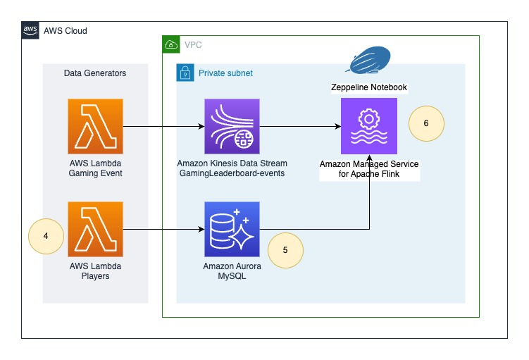

## Real time gaming leaderboard using Apache Flink

This repository supports five part series about the streaming analytics on AWS and In this video series, we are building
real-time gaming leaderboard application based on real use case to learn all parts of streaming architecture including

* Data Ingestion
* Real-time enrichment using database Change data capture (CDC)
* Data Processing
* Computing results, storing them and
* Visualisation

In this series you will also learn advance analytics techniques like

* Control channel technique for A/B testing, feature switching and parameter updates with zero downtime
* Handling late data arrival
* Exactly-once processing (data-duplication avoidance) and
* Storage of historical data with ability of on-demand replay.

## Structure

This repository contains two folders

1. [infra](infra) which contains aws-cdk source code of the AWS infrastructure
2. [notebooks](notebooks) which contains Amazon Managed Service for Apache Flink Studio (Zeppelin) notebooks. Two of
   them
    1. [challenges.zpln](notebooks/challenges.zpln): Which contains progressive challenge for specific parts.
    2. [answers.zpln](notebooks/answers.zpln): Which contains progressive answers to the challenges.

Repository has two git branches for each section of the learning objective.

- With module number and `setup` post-fix. Example: `1-ingestion-setup`
- With module number and `answer` post-fix. Example: `1-ingestion-answer`

You should check out respective `setup` branch to create infrastructure setup required for you to start working on given
module. `answer` branch contains answer of a challenge.

## Pre-requisites

- Latest Node JS and npm
- Latest cdk `npm install -g aws-cdk`

## Deploying

1. Take a check out of a specific branch (or download source code from
   the [tags](https://github.com/build-on-aws/real-time-gaming-leaderboard-apache-flink/tags))
2. Go to the [infra](infra) folder and run `npm install`
3. Go to the [infra](infra) folder and run `cdk bootstrap` if using CDK for the first time in the given AWS account and
   region, else skip this step.
4. Go to the [infra](infra) folder and run `cdk deploy`

## Progressive modules

You can check out any of the below branch to directly start learning from that point on-wards or download source code at
that level from the [tags](https://github.com/build-on-aws/real-time-gaming-leaderboard-apache-flink/tags)

1. [1-ingestion-setup](https://github.com/build-on-aws/real-time-gaming-leaderboard-apache-flink/tree/1-ingestion-setup):
   Sets up kinesis data stream, notebook role and data generator to automatically publish gaming
   events to the source stream.
   
2. [1-ingestion-answer](https://github.com/build-on-aws/real-time-gaming-leaderboard-apache-flink/tree/1-ingestion-answer):
   Sets up Amazon Managed Service for Apache Flink Studio (Flink Zeppelin Notebook) application. Adds challenge answer
   in [answers.zpln](notebooks/answers.zpln) notebook.
3. [2-cdc-enrichment-setup](https://github.com/build-on-aws/real-time-gaming-leaderboard-apache-flink/tree/2-cdc-enrichment-setup):
   Adds setup of MySQL database, data generator for MySQL, Connectivity between studio notebook and
   MySQL.
   
4. [2-cdc-enrichment-answer](https://github.com/build-on-aws/real-time-gaming-leaderboard-apache-flink/tree/2-cdc-enrichment-answer)
   adds challenge answer in [answers.zpln](notebooks/answers.zpln) notebook.
5. [3-process-store-visualize-setup](https://github.com/build-on-aws/real-time-gaming-leaderboard-apache-flink/tree/3-process-store-visualize-setup):
   Adds new kinesis data stream to receive Redis queries, Lambda to execute those to Amazon MemoryDB and Grafana
   installed on EC2 for visualization.
   
6. [4-dynamic-config-setup](https://github.com/build-on-aws/real-time-gaming-leaderboard-apache-flink/tree/4-dynamic-config-setup):
   Adds new kinesis data stream and Lambda to publish config updates to Amazon Managed Service for Apache
   Flink.
   
7. [5-archive-and-replay-setup](https://github.com/build-on-aws/real-time-gaming-leaderboard-apache-flink/tree/5-archive-and-replay-setup):
   Adds two new Amazon Managed Service for Apache Flink applications. One to store data to S3 and one to
   replay.
   